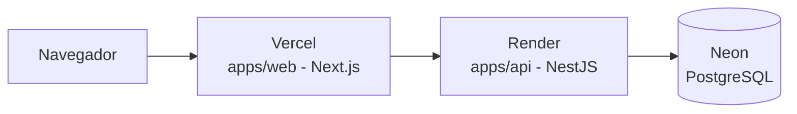

# Arquitectura

Visión general del sistema en su estado actual. Para el razonamiento detrás
de cada decisión, ver [`docs/adr`](./adr).

## Stack

- **Web**: Next.js 15 (`apps/web`), desplegado en Vercel.
- **API**: NestJS (`apps/api`), monolito modular, desplegado en Render.
- **Base de datos**: PostgreSQL gestionado en Neon, accedido vía Prisma.
- **Redis**: previsto para cache/colas (ej. jobs de SRS), aún no integrado en
  el despliegue.
- **Docker**: usado para desarrollo local (`docker-compose.yml`, Postgres +
  Redis) y para construir la imagen de producción del API (`apps/api/Dockerfile`).

## Flujo en producción

## Estructura del monorepo

- `apps/web` — frontend Next.js.
- `apps/api` — backend NestJS (auth, curriculum, exercises, srs, analytics,
  billing como módulos internos; ver ADR 0001).
- `packages/shared` — tipos y esquemas zod compartidos entre web y api.
- `content/de/a1` — contenido del curso (YAML/JSON versionado en git, validado
  por esquema); previsto, aún no presente en el repo (ver ADR 0006).

## Pipeline de despliegue

- **CI**: GitHub Actions (`.github/workflows/ci.yml`), en cada PR y en push a
  `main` — instala dependencias, `pnpm lint`, `pnpm typecheck`, `pnpm test`.
- **CD**: no hay pipeline de CD propio. Un push a `main` dispara redespliegue
  automático tanto en Vercel (web) como en Render (api), cada uno vía su
  integración nativa con GitHub.
- **Migraciones**: `prisma migrate deploy` se ejecuta en el arranque del
  contenedor del API, encadenado en el `CMD` del Dockerfile antes de levantar
  la app (ver ADR 0004).
