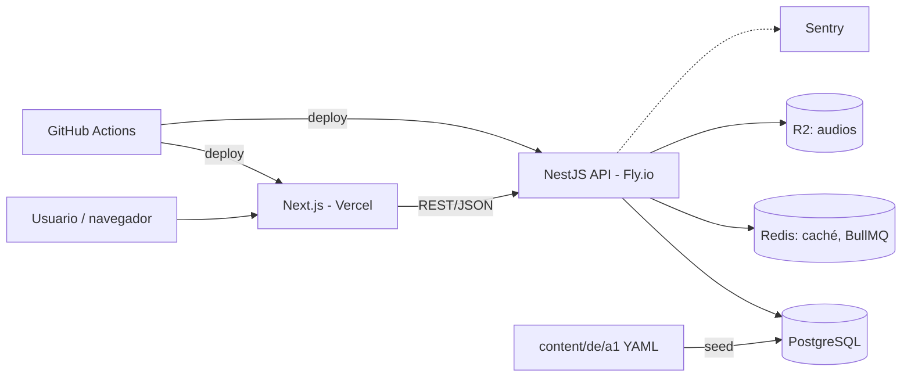

# Plan de MVP — App de aprendizaje de alemán (nivel academia, MCER)

> Documento de planificación técnica y de producto. Versión 1.0 — Julio 2026.
> Nombre de trabajo del proyecto: **Sprachbaum** (cámbialo por el que prefieras; usa un placeholder consistente en el código, p. ej. `sprachbaum`).

---

## 1. Resumen ejecutivo

**Objetivo del MVP:** una web app desplegada en producción con el **nivel A1 de alemán completo**, estructurado según el MCER, con:

- Currículo por lecciones (gramática + vocabulario + Lesen + Hören).
- Sistema de repaso espaciado (SRS con algoritmo FSRS) para vocabulario.
- Ejercicios autocorregibles de varios tipos.
- Analítica básica de progreso (dominio por skill, actividad, retención).
- Autenticación completa y base preparada para billing (sin cobrar aún).
- CI/CD, tests y despliegue reproducible.

**Lo que NO es el MVP:** corrección IA de escritura, pronunciación, tracks profesionales, simulacros de examen, A2–C1, apps nativas, pagos activos. Todo eso va en v2/v3 sobre los cimientos que dejamos preparados aquí.

**Duración estimada:** 14–16 semanas a tiempo parcial (estudiante de último curso), organizadas en 5 milestones.

---

## 2. Alcance del MVP

### 2.1 Dentro del alcance (in scope)

| Área | Contenido |
|---|---|
| Currículo | Nivel A1 completo: ~12 lecciones (Lektionen), cada una con teoría de gramática, lista de vocabulario, 1 reading y 1 listening |
| Ejercicios | Huecos (fill-in-the-blank), elección múltiple, ordenar frases, emparejar, dictado simple, comprensión lectora/auditiva con preguntas |
| SRS | Repaso espaciado de vocabulario con FSRS; sesión diaria de repaso |
| Progresión | Desbloqueo de lecciones por dominio (umbral de acierto), test de fin de nivel |
| Analítica | Dominio por skill (mapa de calor gramática/vocab), racha de estudio real (días activos, sin gamificación agresiva), curva de retención, evolución por destreza |
| Cuentas | Registro/login (email + OAuth Google), perfil, ajustes |
| Infra | Docker, CI/CD con GitHub Actions, despliegue en producción, monitorización de errores (Sentry), seeds de contenido |
| Base para billing | Modelo de datos de planes/entitlements y feature flags (Stripe se integra en v2) |

### 2.2 Fuera del alcance (out of scope, v2+)

- Corrección IA de redacciones y tutor conversacional (v2).
- Evaluación de pronunciación (v3).
- Track profesional IT (v3).
- Niveles A2–C1 (contenido incremental desde v2).
- App móvil nativa (la web será PWA responsive).
- Stripe activo con cobros reales (v2; en MVP todo el contenido A1 es gratis).

### 2.3 Criterio de éxito del MVP

1. Un usuario nuevo puede registrarse, completar la lección 1 y recibir su primera sesión de repaso SRS al día siguiente.
2. El panel de analítica refleja datos reales derivados del event stream (no contadores ad-hoc).
3. `git push` a `main` despliega automáticamente a producción con tests en verde.
4. Tú mismo usas la app a diario para estudiar A1 (dogfooding: si no la usas tú, nadie lo hará).

---

## 3. Arquitectura

### 3.1 Stack elegido

| Capa | Tecnología | Justificación |
|---|---|---|
| Frontend | **Next.js 15 (App Router) + TypeScript + Tailwind** | SSR/ISR para landing y SEO, React para la app; stack demandadísimo |
| Backend | **NestJS (TypeScript)** monolito modular | Arquitectura por módulos de dominio, DI, testeable; un solo lenguaje en todo el repo reduce fricción |
| Base de datos | **PostgreSQL 16** | Relacional para currículo, usuarios, SRS; JSONB para payloads de ejercicios |
| ORM | **Prisma** | Migraciones versionadas, tipado end-to-end |
| Caché / colas ligeras | **Redis** (+ BullMQ) | Sesiones, rate limiting, jobs (p. ej. recálculo nocturno de analítica) |
| Auth | **Auth.js** en el front + JWT/refresh contra el backend, OAuth Google | Estándar, sin vendor lock-in |
| Almacenamiento de audio | **S3-compatible** (Cloudflare R2) | Audios de listenings; R2 no cobra egress |
| Infra | **Docker Compose** local; despliegue en **Fly.io o Railway** (backend+Postgres+Redis) y **Vercel** (front) | Barato, reproducible; migrable a AWS+Terraform en v3 si quieres lucir IaC |
| CI/CD | **GitHub Actions** | Lint, typecheck, tests, build, deploy |
| Observabilidad | **Sentry** (errores) + logs estructurados (pino) | Suficiente para MVP |
| Tests | **Vitest/Jest** (unidad), **Supertest** (API), **Playwright** (E2E críticos) | Pirámide de tests real |

**Decisión clave — monolito modular, no microservicios:** en el MVP no hay ninguna carga que justifique servicios separados. La estructura por módulos de NestJS (bounded contexts) te deja extraer el futuro servicio de evaluación IA a una cola + worker en v2 sin reescribir nada. Documenta esta decisión en un ADR (Architecture Decision Record) — los ADRs en el repo puntúan mucho en un portfolio.

### 3.2 Estructura del repositorio (monorepo)

```
sprachbaum/
├── apps/
│   ├── web/                  # Next.js
│   └── api/                  # NestJS
│       └── src/modules/
│           ├── auth/
│           ├── users/
│           ├── curriculum/   # niveles, lecciones, skills
│           ├── exercises/    # tipos de ejercicio, intentos, corrección
│           ├── srs/          # tarjetas, scheduler FSRS
│           ├── analytics/    # event stream, agregados, insights
│           └── billing/      # planes y entitlements (stub en MVP)
├── packages/
│   ├── shared/               # tipos y validadores (zod) compartidos front/back
│   └── content-schema/       # esquema del contenido del curso
├── content/
│   └── de/a1/                # contenido A1 en YAML/JSON versionado en git
├── docs/
│   ├── adr/                  # decisiones de arquitectura
│   └── architecture.md
├── docker-compose.yml
├── .github/workflows/
└── CLAUDE.md                 # contexto para Claude Code (ver sección 7)
```

**El contenido del curso vive en el repo** como ficheros YAML validados por esquema (zod), y un comando `pnpm content:seed` lo carga en Postgres. Ventajas: revisión por PR, diffs legibles, pipeline futuro de generación con LLM + revisión humana, y separación limpia contenido/código.

### 3.3 Diagrama de arquitectura



### 3.4 Modelo de datos (núcleo)

Entidades principales y relaciones (esquema Prisma resumido):

```
User(id, email, name, locale, createdAt)
Level(id, code)                      # 'A1'
Lesson(id, levelId, order, title, objectives)
Skill(id, levelId, type, name)       # type: GRAMMAR | VOCAB_TOPIC | READING | LISTENING
LessonSkill(lessonId, skillId)
VocabItem(id, skillId, lemma, translation, example, audioUrl, gender, plural)
Exercise(id, lessonId, skillId, type, payload JSONB, solution JSONB, difficulty)
Attempt(id, userId, exerciseId, answer JSONB, isCorrect, latencyMs, createdAt)
SrsCard(id, userId, vocabItemId, stability, difficulty, due, lastReview, state)
LearningEvent(id, userId, type, entityId, data JSONB, createdAt)   # append-only
SkillMastery(userId, skillId, score, updatedAt)                    # agregado derivado
Plan(id, code)          # FREE, PLUS (stub)
Entitlement(userId, feature, source)
```

Principio rector: **`LearningEvent` es la fuente de verdad de la analítica.** `SkillMastery` y demás vistas se recalculan desde eventos (job nocturno + actualización incremental en caliente). Esto te permite añadir nuevas métricas en el futuro sin haber perdido datos.

### 3.5 SRS con FSRS

- Usa la librería **ts-fsrs** (implementación TypeScript del algoritmo FSRS) en el módulo `srs`.
- Cada `VocabItem` estudiado genera una `SrsCard`. La sesión diaria mezcla tarjetas vencidas (due) + un cupo de tarjetas nuevas configurable (por defecto 10/día).
- Calificación de 4 botones (Again/Hard/Good/Easy) o derivada automáticamente del resultado del ejercicio cuando el repaso es en formato ejercicio.
- Endpoint clave: `GET /srs/session` (construye la sesión) y `POST /srs/review` (aplica la transición FSRS y emite `LearningEvent`).

---

## 4. Épicas e issues para GitHub

Convenciones: labels `epic`, `feat`, `chore`, `bug`, `content`, `infra`; prioridad `P0` (bloqueante MVP), `P1` (MVP deseable), `P2` (si sobra tiempo). Estimaciones en puntos (1 pt ≈ media jornada tuya). Usa **GitHub Projects** (tablero) con columnas Backlog / Ready / In progress / In review / Done, y **milestones M1–M5**.

### Épica E1 — Fundaciones del proyecto (M1) — `epic:foundations`

| # | Issue | Prio | Pts |
|---|---|---|---|
| 1 | Inicializar monorepo (pnpm workspaces + turborepo), apps `web` y `api`, paquete `shared` | P0 | 2 |
| 2 | Docker Compose: Postgres + Redis + api + web con hot reload | P0 | 2 |
| 3 | Configurar Prisma + primera migración (User, Level, Lesson) | P0 | 1 |
| 4 | Linting/format (ESLint flat config + Prettier) + husky pre-commit | P0 | 1 |
| 5 | CI: workflow de lint + typecheck + tests en cada PR | P0 | 2 |
| 6 | CD: deploy automático de `api` a Fly.io y `web` a Vercel desde `main` | P0 | 3 |
| 7 | Sentry en front y back + logging estructurado con pino | P1 | 1 |
| 8 | `docs/adr/0001-monolito-modular.md` y `docs/architecture.md` con diagrama | P1 | 1 |
| 9 | Crear `CLAUDE.md` con convenciones del repo (ver sección 7.3) | P0 | 1 |

**Definition of Done de la épica:** un cambio trivial llega a producción vía PR con checks en verde.

### Épica E2 — Autenticación y usuarios (M1) — `epic:auth`

| # | Issue | Prio | Pts |
|---|---|---|---|
| 10 | Registro/login con email+password (hash argon2, verificación por email) | P0 | 3 |
| 11 | OAuth Google | P1 | 2 |
| 12 | Sesiones JWT + refresh tokens con rotación; guards en NestJS | P0 | 2 |
| 13 | Página de perfil y ajustes (idioma de la UI: es/en; objetivo diario de tarjetas) | P1 | 2 |
| 14 | Rate limiting (Redis) en endpoints de auth | P1 | 1 |
| 15 | Tests de integración del flujo completo de auth | P0 | 2 |

### Épica E3 — Currículo y contenido A1 (M2–M4, transversal) — `epic:content`

| # | Issue | Prio | Pts |
|---|---|---|---|
| 16 | Definir `content-schema` (zod): lección, skill, vocab, ejercicio, reading, listening | P0 | 2 |
| 17 | Comando `content:seed` idempotente (upsert por slug) | P0 | 2 |
| 18 | Syllabus A1: mapa de 12 lecciones con objetivos MCER (basado en inventarios Goethe A1) | P0 | 2 |
| 19–24 | Contenido lecciones 1–6 (una issue por par de lecciones): gramática, ~40 palabras/lección, 8–12 ejercicios, 1 reading | P0 | 3×3 |
| 25–27 | Contenido lecciones 7–12 (ídem) | P0 | 3×3 |
| 28 | Audios de listenings: generación TTS (voz alemana de calidad) + subida a R2 + script de pipeline | P0 | 3 |
| 29 | Test de fin de nivel A1 (60 preguntas mezclando destrezas) | P1 | 3 |
| 30 | Revisión de calidad del contenido con hablante/profesor o herramienta de verificación (checklist documentada) | P1 | 2 |

> Consejo: escribe tú el contenido de las lecciones 1–2 a mano para fijar el estándar de calidad, y a partir de ahí usa el pipeline LLM+revisión (sección 7.5).

### Épica E4 — Motor de ejercicios (M2) — `epic:exercises`

| # | Issue | Prio | Pts |
|---|---|---|---|
| 31 | Modelo `Exercise`/`Attempt` + endpoint de corrección server-side | P0 | 2 |
| 32 | Componente FillInTheBlank (con tolerancia a mayúsculas/espacios, feedback de diacríticos ä/ö/ü/ß + teclado en pantalla) | P0 | 3 |
| 33 | Componente MultipleChoice | P0 | 1 |
| 34 | Componente SentenceOrder (drag & drop accesible) | P0 | 3 |
| 35 | Componente Matching (parejas palabra-traducción/imagen) | P1 | 2 |
| 36 | Componente Dictation (reproductor + input; comparación con distancia de edición y resaltado de errores) | P1 | 3 |
| 37 | Player de listening con velocidad 0.75x/1x y transcripción ocultable | P0 | 2 |
| 38 | Vista de Reading con glosario tap-to-translate de palabras marcadas | P1 | 2 |
| 39 | Runner de lección: secuencia teoría → ejercicios → resumen de resultados | P0 | 3 |
| 40 | Emisión de `LearningEvent` en cada intento (tipo, acierto, latencia, skill) | P0 | 1 |
| 41 | Tests E2E (Playwright): completar una lección entera | P0 | 2 |

### Épica E5 — SRS de vocabulario (M3) — `epic:srs`

| # | Issue | Prio | Pts |
|---|---|---|---|
| 42 | Integrar ts-fsrs; modelo `SrsCard` + transición de estados | P0 | 2 |
| 43 | Endpoint `GET /srs/session` (due + nuevas, límites configurables) | P0 | 2 |
| 44 | UI de sesión de repaso (flashcard con audio, revelar, 4 botones de calificación) | P0 | 3 |
| 45 | Modo "repaso como ejercicio": la tarjeta se presenta como hueco o elección múltiple y la calificación FSRS se deriva del resultado | P1 | 2 |
| 46 | Widget "tarjetas pendientes hoy" en el dashboard | P0 | 1 |
| 47 | Tests unitarios del scheduler (casos: nueva, lapse, madura) | P0 | 2 |

### Épica E6 — Progresión y desbloqueo (M3) — `epic:progression`

| # | Issue | Prio | Pts |
|---|---|---|---|
| 48 | Cálculo de `SkillMastery` (acierto ponderado por recencia; umbral de dominio 80%) | P0 | 2 |
| 49 | Regla de desbloqueo: lección N+1 requiere ≥70% en ejercicios de la N | P0 | 1 |
| 50 | Mapa del curso (vista de nivel con lecciones, estados: bloqueada/en curso/dominada) | P0 | 3 |
| 51 | Test de nivel A1 con puntuación por destreza y certificado interno descargable | P2 | 2 |

### Épica E7 — Analítica de progreso (M4) — `epic:analytics`

| # | Issue | Prio | Pts |
|---|---|---|---|
| 52 | Job nocturno (BullMQ) de agregación de eventos → tablas de resumen diario | P0 | 2 |
| 53 | Dashboard: actividad (días activos, tiempo estimado, ejercicios/semana) | P0 | 2 |
| 54 | Mapa de calor de dominio por skill de gramática y por tema de vocabulario | P0 | 3 |
| 55 | Curva de retención de vocabulario (proyección FSRS: % que recordarás hoy/en 7/30 días) | P1 | 2 |
| 56 | Sección "Puntos débiles" con CTA que genera una sesión de práctica dirigida a las 3 skills peores | P0 | 3 |
| 57 | Evolución por destreza (Lesen vs. Hören vs. gramática) en el tiempo | P1 | 2 |
| 58 | Endpoint de export de datos del usuario (JSON) — base para GDPR | P1 | 1 |

### Épica E8 — Base de monetización (M5) — `epic:billing`

| # | Issue | Prio | Pts |
|---|---|---|---|
| 59 | Modelo `Plan`/`Entitlement` + servicio de feature flags (`hasFeature(user, 'ai_corrections')`) | P0 | 2 |
| 60 | Gating declarativo en rutas/UI (todo A1 = FREE en MVP; contenido A2+ marcado PLUS) | P1 | 1 |
| 61 | Página de precios estática (sin checkout) + waitlist de "Plus" para medir intención de pago | P1 | 1 |
| 62 | ADR de la futura integración Stripe (webhooks, customer portal, estados de suscripción) | P2 | 1 |

### Épica E9 — Pulido, legal y lanzamiento (M5) — `epic:launch`

| # | Issue | Prio | Pts |
|---|---|---|---|
| 63 | Landing page con propuesta de valor + SEO básico | P0 | 2 |
| 64 | PWA: manifest, iconos, uso offline básico de la sesión SRS descargada | P2 | 3 |
| 65 | Accesibilidad: navegación por teclado en todos los ejercicios, contraste AA | P1 | 2 |
| 66 | Política de privacidad + términos + banner de cookies mínimo (GDPR) | P0 | 1 |
| 67 | Onboarding: cuestionario inicial (¿por qué alemán?, objetivo, minutos/día) → personaliza cupo SRS | P1 | 2 |
| 68 | Beta cerrada: invitar 10–20 usuarios, formulario de feedback, corrección de bugs | P0 | 3 |
| 69 | README de portfolio: capturas, arquitectura, decisiones, demo pública | P0 | 1 |

### Milestones

| Milestone | Semanas | Épicas | Resultado |
|---|---|---|---|
| **M1 — Esqueleto en producción** | 1–3 | E1, E2 | Deploy continuo funcionando, login operativo |
| **M2 — Primera lección jugable** | 4–6 | E4 + lecciones 1–2 (E3) | Un usuario completa la lección 1 de principio a fin |
| **M3 — Estudiar de verdad** | 7–9 | E5, E6 + lecciones 3–6 | SRS diario + desbloqueo por dominio |
| **M4 — Verse progresar** | 10–12 | E7 + lecciones 7–10 | Dashboard de analítica completo |
| **M5 — Lanzamiento beta** | 13–16 | E8, E9 + lecciones 11–12 | Beta pública con A1 completo |

---

## 5. Riesgos principales y mitigaciones

1. **El contenido es el 40% del esfuerzo real.** Mitigación: pipeline LLM + tu revisión (que a la vez es tu estudio), estándar fijado a mano en las lecciones 1–2, y alcance cerrado a A1.
2. **Scope creep** (la tentación de meter IA/tracks ya). Mitigación: todo lo que no esté en las épicas E1–E9 va a un fichero `docs/backlog-v2.md`, no al tablero.
3. **Calidad lingüística.** No eres (aún) hablante de alemán. Mitigación: basar el syllabus en inventarios oficiales A1, verificación cruzada con múltiples fuentes, y a ser posible una pasada de un profesor/nativo antes de la beta (issue 30).
4. **Burnout de proyecto largo.** Mitigación: milestones que producen algo usable cada 3 semanas y dogfooding desde M2 — estudiar con tu propia app es la motivación que se retroalimenta.

---

## 6. Definición de "hecho" (Definition of Done) global

Una issue solo se cierra si: (1) tiene tests que cubren el caso feliz y al menos un caso de error, (2) pasa CI, (3) está desplegada en producción, (4) si toca API o modelo de datos, la documentación (`architecture.md` o ADR) está actualizada.

---

## 7. Cómo llevar el proyecto a cabo con Claude

Esta sección explica el entorno de desarrollo recomendado y cómo optimizar el uso de Claude en tu ordenador para este proyecto en concreto.

### 7.1 Herramienta principal: Claude Code

Para un proyecto así, la herramienta idónea es **Claude Code**: el agente de programación de Anthropic que trabaja directamente sobre tu repositorio — lee tu código, edita ficheros, ejecuta comandos y tests, y maneja git, todo desde el terminal o integrado en tu IDE. A diferencia del chat, opera dentro de tu entorno real de desarrollo, con el contexto de todo el proyecto.

**Instalación y requisitos:**
- Necesitas una suscripción de Claude (Pro o superior) o una cuenta de Claude Console con crédito de API; el plan gratuito no incluye Claude Code.
- El método recomendado es el **instalador nativo** (no requiere Node.js y se autoactualiza); también puede instalarse vía npm (`npm install -g @anthropic-ai/claude-code`) o gestores de paquetes del sistema. En Windows funciona nativamente o vía WSL.
- Tras instalar: `cd` a la carpeta del proyecto, ejecuta `claude`, y autentícate en el navegador la primera vez.
- Está disponible como CLI, app de escritorio, y extensiones para **VS Code y JetBrains**.
- Documentación oficial y guía de inicio: https://docs.claude.com/en/docs/claude-code/overview

**Entorno de desarrollo recomendado para este proyecto:**
- **VS Code + extensión de Claude Code** (o el CLI en un panel del terminal): ves los diffs que propone Claude dentro del editor y los apruebas ahí.
- **Docker Desktop** con el `docker-compose.yml` del repo levantado: Claude puede ejecutar `docker compose up`, correr migraciones de Prisma y lanzar tests contra la base de datos real.
- Un terminal con **paneles divididos** (tmux, Zellij, o el terminal integrado de VS Code): Claude Code a la izquierda, logs de `docker compose` y del dev server a la derecha.
- **Node LTS gestionado con nvm/fnm** y **pnpm** como gestor de paquetes del monorepo.

### 7.2 El fichero CLAUDE.md: la pieza más importante

Claude Code lee automáticamente el fichero `CLAUDE.md` de la raíz del repo en cada sesión. Es tu forma de darle memoria permanente sobre el proyecto. Para este proyecto debería contener:

```markdown
# Sprachbaum — contexto para Claude Code

## Qué es
App de aprendizaje de alemán por niveles MCER (MVP = A1). Monorepo pnpm:
apps/web (Next.js 15), apps/api (NestJS), packages/shared (tipos+zod).

## Comandos
- pnpm dev          # levanta web+api (requiere docker compose up -d)
- pnpm test         # unit tests (vitest)
- pnpm test:e2e     # Playwright
- pnpm db:migrate   # prisma migrate dev
- pnpm content:seed # carga content/de/a1 en Postgres

## Convenciones
- TypeScript estricto; nada de `any`
- Validación de entrada con zod en el borde (controllers y formularios)
- Toda mutación de aprendizaje emite un LearningEvent (append-only)
- La corrección de ejercicios SIEMPRE ocurre en el servidor
- Commits: Conventional Commits (feat:, fix:, chore:)
- Tests obligatorios para servicios de dominio (srs, exercises, analytics)

## Arquitectura
Ver docs/architecture.md y docs/adr/. No introducir microservicios;
es un monolito modular a propósito.

## Qué NO hacer
- No añadir features fuera del milestone actual (ver GitHub Projects)
- No tocar el esquema de content-schema sin actualizar el seed y los ADR
```

Mantén este fichero actualizado como si fuera código: cada vez que Claude cometa el mismo error dos veces, añade la regla que lo evita.

### 7.3 Flujo de trabajo diario recomendado

1. **Una issue = una sesión.** Abre Claude Code y dale la issue tal cual: "Implementa la issue #43: endpoint GET /srs/session…". Sesiones cortas y con objetivo claro funcionan mucho mejor que maratones, porque el contexto del modelo es finito y se degrada si lo llenas de temas mezclados.
2. **Planifica antes de escribir código.** Para issues de más de 1 punto, pide primero un plan ("plantea el diseño antes de tocar código", o usa el modo de planificación de Claude Code) y revísalo. Corregir un plan cuesta segundos; corregir 400 líneas mal enfocadas cuesta una tarde.
3. **TDD con el agente.** Pídele que escriba primero los tests del scheduler FSRS o del servicio de corrección, los ejecute (fallando), y luego implemente hasta ponerlos en verde. Claude Code puede ejecutar `pnpm test` él mismo e iterar sobre los fallos.
4. **Revisa cada diff.** Claude Code pide permiso antes de modificar ficheros; no actives el modo "aceptar todo" mientras aprendes cómo trabaja. Tú eres el ingeniero responsable — y además, revisar sus diffs es donde más vas a aprender.
5. **Commits pequeños y descriptivos.** Pídele que haga commit al cerrar cada sub-tarea; él redacta buenos mensajes de Conventional Commits.
6. **Contexto limpio.** Cuando cambies de tema (de backend SRS a UI de flashcards), empieza sesión nueva o usa `/clear`. Usa `/compact` si una sesión larga sigue siendo necesaria.

### 7.4 Reparto inteligente: qué hacer con Claude Code y qué en el chat

- **Claude Code (en el repo):** implementación de issues, refactors, tests, migraciones, debugging con logs reales, configuración de CI/CD, revisión de PRs (`claude` puede revisar un diff de rama).
- **Claude en claude.ai (chat/proyectos):** diseño de producto y arquitectura (como esta conversación), redacción del syllabus A1, generación de contenido de lecciones (ver 7.5), textos de la landing, dudas conceptuales de alemán mientras estudias. Crea un **Proyecto** en claude.ai con este documento y `architecture.md` como conocimiento base para que todas las conversaciones partan del mismo contexto.
- **GitHub Actions + Claude Code** (opcional, v2): Claude Code se integra con GitHub Actions, lo que permite automatizar revisiones de PR o tareas etiquetadas en issues. Como proyecto de portfolio, montar esto en v2 es un extra vistoso.

### 7.5 Pipeline de contenido con Claude (tu multiplicador)

El contenido A1 es tu mayor coste. Automatízalo así:

1. Define el `content-schema` (issue 16) con ejemplos anotados.
2. En un Proyecto de claude.ai, guarda: el esquema, el syllabus A1, y las lecciones 1–2 escritas a mano como *gold standard*.
3. Para cada lección nueva, pide a Claude el YAML completo (vocabulario con género y plural, ejercicios con soluciones, reading graduado al vocabulario ya visto) y **valídalo automáticamente**: el CI ejecuta el validador zod + checks de consistencia (que ninguna palabra del reading esté fuera del vocabulario acumulado, que las soluciones existan, etc.).
4. Revisión humana en la PR del contenido: tú revisas estudiando (dogfooding) y, antes de la beta, una pasada de un nativo/profesor.
5. Los audios: script que recorre los listenings y genera TTS → R2 (issue 28).

Este pipeline (generación LLM + validación automática + revisión humana en PR) es en sí mismo una pieza de portfolio excelente y el mismo mecanismo te servirá para A2–C1 y los tracks profesionales.

### 7.6 Optimización práctica del uso de Claude en tu máquina

- **Prompts concretos ganan.** "Arregla el bug" rinde mal; "arregla el bug por el que el scheduler devuelve tarjetas con `due` en el futuro cuando el usuario cambia de zona horaria; hay un test que lo reproduce en `srs.spec.ts`" rinde muy bien.
- **Dale herramientas de verificación.** Claude Code trabaja mucho mejor cuando puede comprobarse a sí mismo: tests rápidos, `pnpm typecheck`, seeds reproducibles. Invertir en E1 (fundaciones) multiplica el rendimiento de todo lo demás.
- **MCP para contexto externo (opcional):** Claude Code soporta servidores MCP; conectar Playwright (para que verifique la UI navegando de verdad) o GitHub (para leer/gestionar issues desde la sesión) son los dos más útiles en este proyecto.
- **Vigila el consumo.** Las sesiones largas y paralelas consumen límites del plan más rápido; en plan Pro, trabaja en serie y con sesiones acotadas. Si el proyecto avanza y Claude Code se convierte en tu herramienta diaria, evalúa subir de plan.
- **Documenta para el agente y para ti.** Los ADRs, el `architecture.md` y el `CLAUDE.md` no son burocracia: son el contexto que hace que cada sesión nueva de Claude empiece "sabiendo" el proyecto, y son oro para el README de portfolio.

Para detalles siempre actualizados (comandos de sesión, modos, integraciones): https://docs.claude.com/en/docs/claude-code/overview

---

## 8. Próximos pasos inmediatos

1. Crear el repo `sprachbaum` en GitHub, subir este documento a `docs/plan-mvp.md`.
2. Crear el GitHub Project, los 5 milestones y las issues de la épica E1 (puedes pedirle a Claude Code que cree las issues vía `gh` CLI a partir de este documento).
3. Instalar Claude Code, escribir el `CLAUDE.md` inicial y arrancar con la issue #1.
